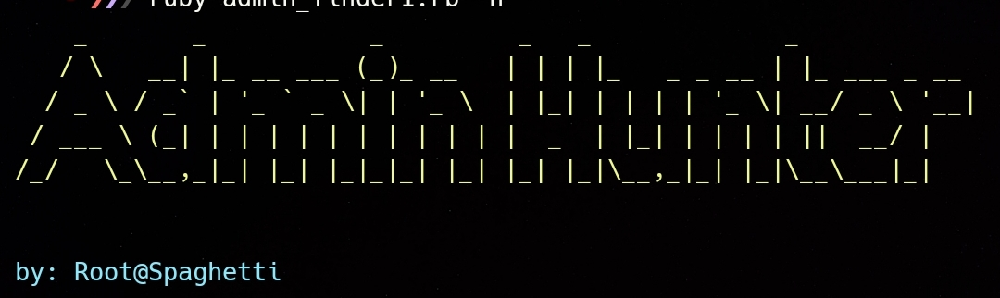

<h1 align="center">  
   Admin Hunter
</h1>

  <strong>Admin Hunter is a powerful Ruby tool designed to uncover hidden admin panels on websites, combining precision scanning with sleek, color-coded output and customizable options.

</strong> 
  Created by <a href="https://github.com/Rootspaghetti">Rootspaghetti</a>

  Admin Hunter is designed to quickly identify admin panel paths on websites, streamlining the reconnaissance phase of security assessments.

 
  Built for bug bounty hunters and penetration testers.

<h2>Features</h2>
<ul>
  <li>Admin Hunter is designed to find admin panels across a domain quickly and efficiently.

</li>
  <li>Supports <code>-u</code> (single url),
    <code>-w</code> (wordlist), and 
    <code>-o</code> (output file).</li>
</ul>

<h2>Installation</h2>

Install Admin Hunter using the following command:

<pre>
<code>git clone https://github.com/Rootspaghetti/admin-hunter
cd admin-hunter
ruby admin_hunter.rb -h
</code>
</pre>

<h2>Usage</h2>

Admin Hunter supports three main parameters:

<ul>
  <li><code>-u</code>: Target URL. (Required)</li>
  <li><code>-w</code>: Path to the wordlist file. (Default: admin.txt)
Optional.</li>
  <li><code>-o</code>: File to save results.
Optional.</li>
</ul>
<h2>Examples</h2>

  
# Basic scan with the default wordlist 
  <pre> <code> 
  ruby admin_hunter.rb -u http://example.com
  </code> </pre>
  

  
# Scan with a custom wordlist and save results to a file 
    <pre>
  <code>ruby admin_hunter.rb -u http://example.com -w custom_wordlist.txt -o output.txt</code>
    </pre>
  

<h2>Contributing</h2>

Feel free to contribute to Admin-Hunter by creating pull requests or reporting issues in the <a href="https://github.com/Rootspaghetti/admin-hunter/issues">issues section</a>.

